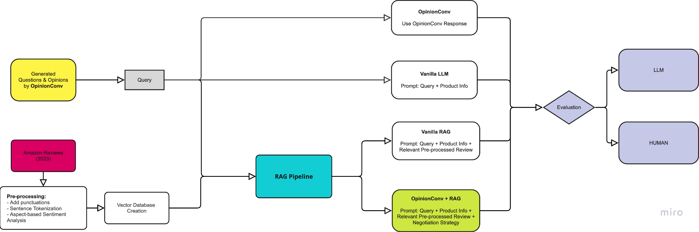

# RAG-OpinionConv

A framework for simulating opinionated conversations for product search and evaluation using RAG, FAISS indexing, and OpinionConv Q-A generation.

---
## Architecture

<p align="center">
  
</p>

---

## Overview

This project generates question-answer pairs from product reviews, indexes them with FAISS, and evaluates retrieval-augmented generation (RAG) for product QA and conversational search.

**Key Features:**
- Generate Q-A pairs from Amazon reviews (OpinionConv)
- FAISS vector indexing with metadata filtering
- RAG pipeline with retrieval + generation
- Automated and human evaluation metrics
- HPC (Marvin) support for large-scale experiments

---

## Quick Start

```bash
# Setup
python3 -m venv .venv
source .venv/bin/activate
pip install -r requirements.txt

# Preprocess reviews
python src/preprocess/tokenize_reviews.py \
  --input data/raw/amazon_reviews_2023.jsonl \
  --output data/processed/reviews_chunks.jsonl

# Generate Q-A pairs
python src/opinionconv/generate_qas.py \
  --input data/processed/reviews_chunks.jsonl \
  --output data/processed/opinion_qas.jsonl

# Build FAISS index
python src/rag_pipeline/build_index.py \
  --input data/processed/reviews_chunks.jsonl \
  --emb_model sentence-transformers/all-MiniLM-L6-v2 \
  --index_path indices/faiss_index.bin

# Query with RAG
python src/rag_pipeline/retrieve_and_generate.py \
  --index_path indices/faiss_index.bin \
  --query "What are common issues with this product?" \
  --k 10
```

---

## Repository Structure

```
RAG-OpinionConv/
├─ data/
│  ├─ raw/amazon_reviews_2023.jsonl
│  └─ processed/
├─ src/
│  ├─ preprocess/
│  ├─ opinionconv/
│  ├─ rag_pipeline/
│  └─ eval/
├─ indices/
├─ requirements.txt
└─ README.md
```

---

## Pipeline

1. **Preprocess** → Tokenize, chunk, and annotate reviews
2. **Generate Q-As** → Create question-answer pairs via OpinionConv
3. **Index** → Build FAISS vector index with embeddings
4. **Retrieve** → Metadata filtering + top-k retrieval
5. **Generate** → RAG prompt → LLM response
6. **Evaluate** → Automated metrics + human annotations

---

## Tech Stack

- Python 3.9+
- langchain, transformers, sentence-transformers
- faiss-cpu/faiss-gpu
- PyTorch (optional)

---

## Data Format

**Input (reviews):**
```json
{
  "review_id": "...",
  "product_id": "...",
  "review_text": "...",
  "rating": 5,
  "date": "2023-05-04"
}
```

**Output (Q-As):**
```json
{
  "chunk_id": "...",
  "product_id": "...",
  "question": "...",
  "answer": "...",
  "source_review_id": "..."
}
```

---

## HPC (Marvin) Usage

```bash
marvin submit --job-name rag-opinionconv \
  --gpus 1 --cpus 8 --mem 32G --time 12:00:00 \
  --command "python src/rag_pipeline/retrieve_and_generate.py --config exp1.yaml"
```

---

## Evaluation

- **Retrieval:** recall@k, precision@k, MRR
- **Generation:** BLEU, Rouge, embedding similarity
- **Human:** Faithfulness, helpfulness (1-5), sentiment accuracy

---

## Contributing

1. Fork and create branch `feature/my-feature`
2. Add tests and update docs
3. Open PR with description

